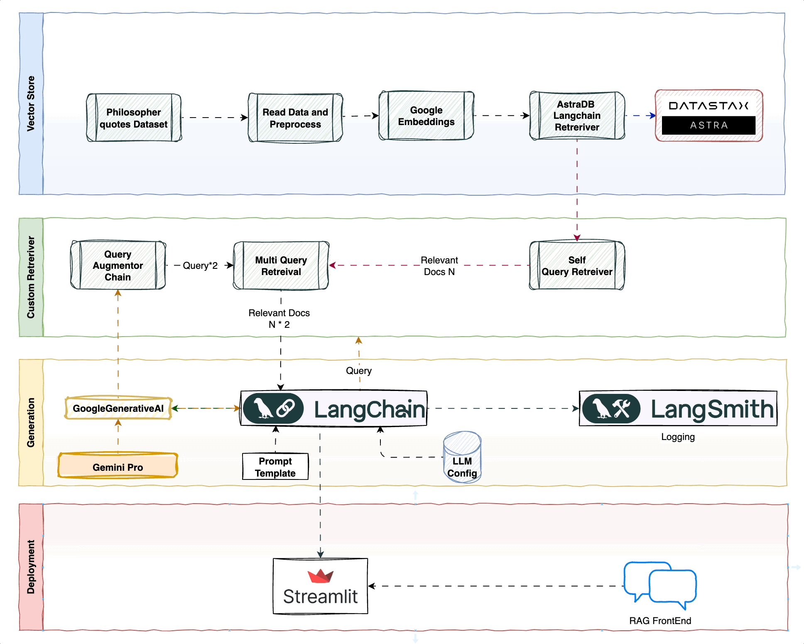
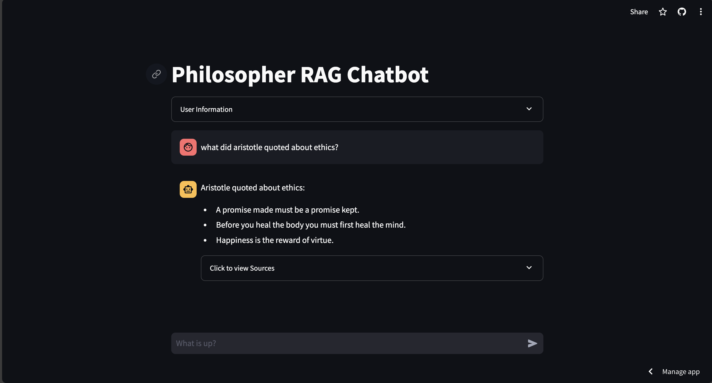

# RAGStackDemo
Streamlit App URL: https://ragstackdemo.streamlit.app/

# Philosopher Quote Retriever with Langchain

This repository contains code for a retrieval system that utilizes Langchain to retrieve quotes from a philosopher based on user queries. The system leverages the following components:

* **Langchain:** A framework for building conversational AI applications.
* **Google Generative AI:** A large language model for text generation and retrieval.
* **Astra DB Vector Store:** A database for storing and searching vector representations of text.
## Architecture Overview

 

### Project Structure:

* `src/`: Contains the core Python code for the chatbot functionality.
    * `rag.py`: Defines the RAG logic for retrieving quotes based on user queries.
    * `chat.py`: Implements the chat interaction logic using Streamlit components.
    * `app.py`: The main Streamlit application file that ties everything together.

### Code:

**rag.py:**

This file handles the core retrieval functionality using Langchain:

* It defines two retrieval chains:
    * `rag_chain_with_source_multi`: Uses a multi-query retriever for retrieving quotes, leveraging paraphrasing to improve retrieval effectiveness.
    * `rag_chain_with_source_basic`: Falls back to a vector score retriever if the multi-query retriever fails.
* It utilizes an LLM (large language model) to generate variations of the user's question for better retrieval.

* **Environment Variables:**
  * `GOOGLE_API_KEY`: API key for accessing Google Generative AI.
  * `ASTRA_DB_API_ENDPOINT`: Endpoint for Astra DB.
  * `ASTRA_DB_APPLICATION_TOKEN`: Authentication token for Astra DB.
  * `ASTRA_DB_KEYSPACE_Philo`: Keyspace name in Astra DB where quotes are stored.
* **LLM (Large Language Model):** An instance of `GoogleGenerativeAI` is created for text generation and retrieval tasks.
* **Vector Embeddings:** A `GoogleGenerativeAIEmbeddings` instance is used to generate vector representations of text for efficient retrieval.
* **Astra DB Vector Store:** A connection to the Astra DB vector store is established using `AstraDBVectorStore`.
* **Retrievers:**
  * `retriever_vector_score`: Retrieves quotes based on vector similarity using the Astra DB vector store.
  * `retriever_self_query`: Uses the LLM to generate multiple query variations based on the user's question to improve retrieval effectiveness.
* **Output Parser:** `LineListOutputParser` parses the LLM response and extracts a list of generated queries.
* **Prompts:**
  * `QUERY_PROMPT`: LLM prompt template for generating multiple query variations.
* **LLM Chain:** Combines the LLM with the `QUERY_PROMPT` and `LineListOutputParser` for query variation generation.
* **Multi-Query Retriever:** `retriever_multi_query` combines the vector score retriever and the LLM chain for retrieving quotes using both similarity search and paraphrased queries.
* **RAG Chain:** Defines the core conversation flow:
  * Retrieves context (quotes) from previous interactions.
  * Processes the user's question along with the retrieved context.
  * Uses the LLM to generate a response based on the context and question.
  * Formats the response for the user.
* **Runnable Chains:**
  * `rag_chain_with_source_multi`: Uses the multi-query retriever for retrieving quotes.
  * `rag_chain_with_source_basic`: Uses the vector score retriever for retrieving quotes (fallback if multi-query retriever fails).

**chat.py:**

This file implements the interactive chat interface using Streamlit:

* It defines the `chatHere` function to handle user input and generate assistant responses.
* It displays chat history, accepts user input, and displays the assistant's response.
* It utilizes the `rag_chain_with_source_multi` and `rag_chain_with_source_basic` functions from `rag.py` for retrieving responses.
* It stores conversation history in the Streamlit session state.

**app.py:**

This file is the main entry point for the Streamlit application:

* It sets the app title and user information section.
* It calls the `chatHere` function from `chat.py` to handle the chat interaction.

**Running the Project:**

1. Install dependencies: `pip install -r requirements.txt`
2. Set the required environment variables (refer to the code for details).
3. Run the script: `streamlit run src/app.py`
4. The script will open streamlit app and asksto prompt you for a question (e.g., "give a quote by plato").
5. It will then retrieve relevant quotes and provide a response based on the retrieved context.

**Note:** This is a basic example and can be extended to include additional features such as:

* Support for retrieving quotes by multiple philosophers.
* Filtering quotes based on tags or categories.
* Summarization of retrieved quotes.
* Integration with Evaluation API for feedback and improvement.
* Integration with much better retreival Stratergies like Colbert, and RAPTOR.

### Screenshots:
https://ragstackdemo.streamlit.app/

 
